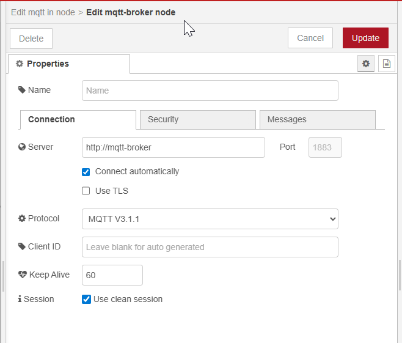
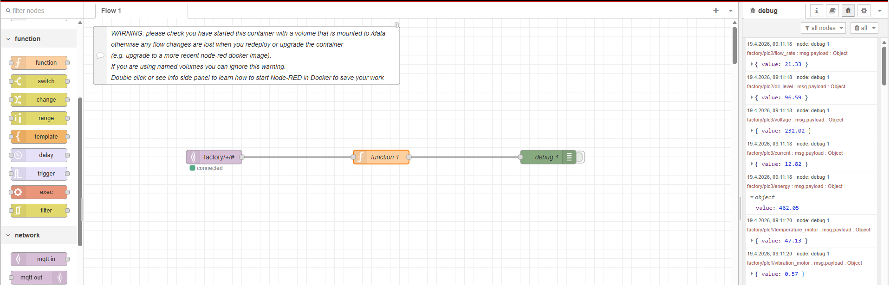

# Corrigé — TP 06 Node-RED : Traitement des données IoT (MQTT → Processing)

---

## Compréhension globale

Dans ce TP, nous avons introduit Node-RED comme moteur de traitement des données.

Son rôle :

* recevoir les données depuis MQTT
* les nettoyer
* les transformer
* les préparer pour stockage

---

## Position dans l’architecture

```text
PLC → OPC UA → Data Collector → MQTT → Node-RED
````

👉 Node-RED transforme les données avant leur stockage.

---

# Étape 1 — Déploiement

---

```bash
docker run -d \
  --name node-red \
  --network iiot-network \
  -p 1880:1880 \
  -v node-red-data:/data \
  --restart unless-stopped \
  nodered/node-red
```

---

## Vérification

```bash
docker ps
```

---

## Accès

```text
http://192.168.56.12:1880
```

---

# Étape 2 — Création du flow

---

## Flow attendu


```text
MQTT IN → Function → DEBUG
```

---

## Configuration MQTT

 



* Broker : mqtt-broker
* Port : 1883

---

## Topic

```text
factory/+/+
```

---

👉 Permet de recevoir toutes les données du système

---

# Étape 3 — Fonction de traitement (IMPORTANT)

---

## Code complet

```javascript
let parts = msg.topic.split("/");

if (parts.length < 3) return null;

let data;
let value;

// parsing intelligent
if (typeof msg.payload === "string") {
    try {
        data = JSON.parse(msg.payload);
    } catch (e) {
        return null;
    }
} else {
    data = msg.payload;
}

// ignorer les timestamps
if (data.tag === "time") return null;

// extraction
let machine = data.plc || parts[1];
let sensor = data.tag || parts[2];

// récupération brute
let raw = data.value;

// conversion industrielle

// cas 1 → nombre direct
if (typeof raw === "number") {
    value = raw;
}

// cas 2 → string (ex: "45,2")
else if (typeof raw === "string") {
    raw = raw.replace(",", ".").trim();
    value = Number(raw);
}

// fallback
else {
    value = Number(raw);
}

// validation
if (isNaN(value)) {
    node.warn("Invalid numeric value: " + JSON.stringify(data));
    return null;
}

// construction measurement
msg.measurement = machine + "_" + sensor;

// payload final
msg.payload = {
    value: value
};

// timestamp
msg.timestamp = data.timestamp;

return msg;
```

---

# Explication détaillée (TRÈS IMPORTANT)

---

## 1. Extraction du topic

```javascript
msg.topic.split("/")
```

Exemple :

```text
factory/plc1/temperature_motor
```

Résultat :

```text
["factory", "plc1", "temperature_motor"]
```

---

## 2. Parsing du payload

Le message peut être :

* string JSON
* objet déjà parsé

👉 On gère les deux cas.

---

## 3. Filtrage

```javascript
if (data.tag === "time") return null;
```

👉 On ignore les timestamps inutiles

---

## 4. Extraction des données

On récupère :

* machine → plc1
* capteur → temperature_motor
* valeur → 45.2

---

## 5. Conversion en nombre (CRITIQUE)

Pourquoi ?

👉 MQTT transporte des strings ou des données brutes

👉 mais InfluxDB et les calculs nécessitent des nombres

---

Cas gérés :

* number → OK
* string → converti
* fallback → Number()

---

## 6. Validation

```javascript
isNaN(value)
```

👉 empêche les erreurs en base de données

---

## 7. Construction du measurement

```javascript
plc1_temperature_motor
```

👉 format compatible InfluxDB

---

## 8. Structure finale

```json
{
  "measurement": "plc1_temperature_motor",
  "value": 45.2,
  "timestamp": 1710000000
}
```
## 9. Deploiement du flow
Aprés de deploiement du flow on devrait avoir un resulat propre comme ceci:



---

# Réponses aux exercices

---

## Exercice 1 — Rôle Node-RED

* traitement
* transformation
* orchestration

👉 cœur logique de l’Edge

---

## Exercice 2 — Pourquoi transformer ?

* données brutes inutilisables
* normalisation nécessaire
* préparation pour stockage

---

## Exercice 3 — MQTT IN

* se connecte au broker
* reçoit les messages
* injecte dans le flow

---

## Exercice 4 — Function

* transforme les données
* applique la logique métier
* nettoie les données

---

## Exercice 5 — Pourquoi convertir en nombre ?

👉 essentiel car :

* bases de données → types stricts
* calculs impossibles avec string
* évite erreurs analytiques

---

# Problèmes fréquents

---

## 1. Aucune donnée

* vérifier MQTT
* vérifier topic
* vérifier Data Collector

---

## 2. Payload incorrect

👉 problème JSON

Solution :

* vérifier JSON.parse
* afficher msg.payload

---

## 3. Valeur NaN

👉 problème conversion

Solution :

* vérifier replace(",", ".")
* vérifier format

---

## 4. Node-RED ne reçoit rien

```bash
docker ps
```

👉 vérifier mqtt-broker

---

## 5. Problème réseau

```bash
docker network inspect iiot-network
```

👉 node-red et mqtt doivent être présents

---

# Architecture finale

---

```text
PLC → OPC UA → Data Collector → MQTT → Node-RED → Processing
```

---

👉 Node-RED prépare les données pour :

* InfluxDB
* Grafana

---

# Conclusion

Dans ce TP, vous avez :

* déployé Node-RED
* connecté MQTT
* traité les données
* construit un pipeline industriel

---

👉 Vous avez maintenant un pipeline IoT complet côté Edge.

---

## Prochaine étape

👉 Stockage des données avec InfluxDB

---

